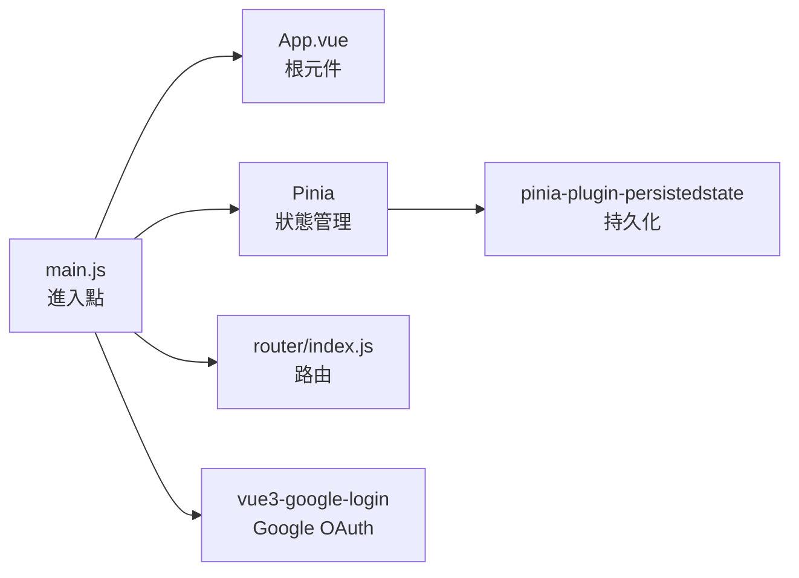
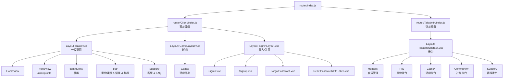
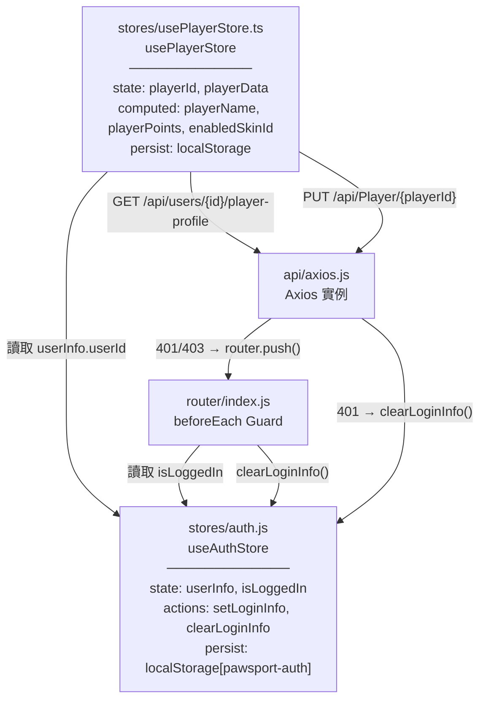
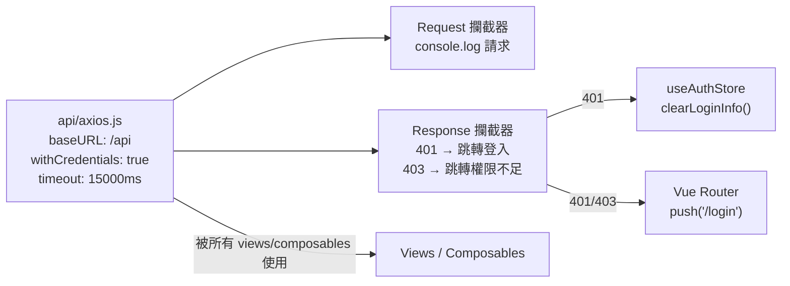
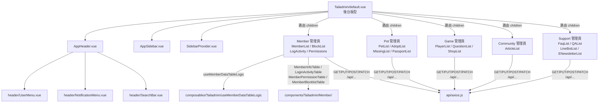
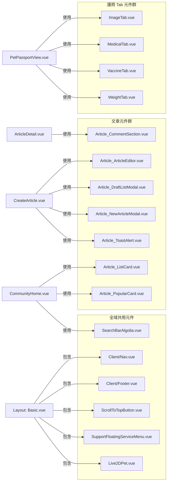
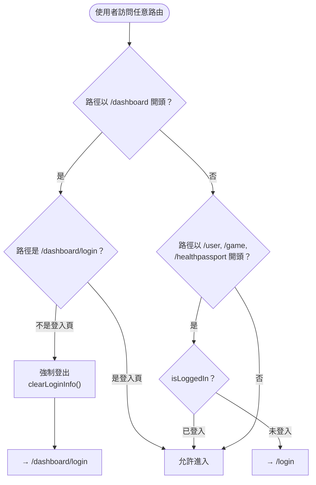

# Petmily Vue 專案知識圖譜

## 1. 應用程式啟動鏈

---

## 2. 路由結構

---

## 3. 全域狀態（Stores）依賴圖

---

## 4. API 層

---

## 5. 前台功能模組圖

```mermaid
graph TD
    subgraph 認證模組
        signin["Signin.vue"]
        signup["Signup.vue"]
        forgot["ForgotPassword.vue"]
        reset["ResetPasswordWithToken.vue"]
        signin & signup & forgot & reset -->|"POST /api/auth/..."| api
    end

    subgraph 會員模組
        profile_view["ProfileView.vue\n/user/profile"]
        profile_comp["components/Client/Profile.vue"]
        profile_view -->|"使用"| profile_comp
        profile_view -->|"GET/PUT /api/users/{id}"| api
        profile_view -->|"GET /api/users/{id}/player-profile"| api
    end

    subgraph 社群模組
        community_home["CommunityHome.vue"]
        article_detail["ArticleDetail.vue"]
        create_article["CreateArticle.vue"]
        mypage["MyPage.vue"]

        community_home -->|"useCommunityHome"| composable_community["composables/useCommunityHome"]
        article_detail -->|"useArticleComments"| composable_comments["composables/useArticleComments"]
        create_article -->|"useEditorState\nuseArticleActions"| composable_editor["composables/useEditorState\ncomposables/useArticleActions"]
        community_home & article_detail & create_article -->|"useCategories"| composable_cat["composables/useCategories"]

        community_home -->|"GET /api/articles"| api
        article_detail -->|"GET /api/articles/{id}"| api
        create_article -->|"POST /api/articles"| api
    end

    subgraph 寵物模組
        passport["PetPassportView.vue"]
        adoption["PetAdoptionView.vue"]
        missing["MissingPetView.vue"]

        passport -->|"ImageTab / MedicalTab\nVaccineTab / WeightTab"| passport_tabs["寵物護照 Tab 元件群"]
        passport -->|"GET/POST /api/passport/..."| api
        adoption -->|"GET /api/Pet/adoption"| api
        missing -->|"GET /api/MissingReports"| api
    end

    subgraph 遊戲模組
        game_view["GameView.vue"]
        gameplay["GamePlay.vue"]
        skinshop["SkinShop.vue"]
        inventory["Inventory.vue"]
        player_profile["PlayerProfile.vue"]

        game_view & gameplay & skinshop & inventory & player_profile -->|"usePlayerStore"| player_store["stores/usePlayerStore"]
        gameplay -->|"useGameAudio"| composable_audio["composables/useGameAudio"]
        gameplay -->|"GET /api/Questions/{category}"| api
        skinshop -->|"GET/POST /api/Shop"| api
    end

    subgraph 客服模組
        faq["FaqView.vue"]
        qa["QAView.vue"]
        enewsletter["ENewsletterView.vue"]
        ai_chat["AiChatFloatView.vue"]

        faq -->|"GET /api/Support/faq"| api
        qa -->|"POST /api/Support/qa"| api
        enewsletter -->|"GET /api/ENewsletter"| api
        ai_chat -->|"SignalR Hub"| hub["AIChatHub (後端)"]
    end

    api["api/axios.js\n→ /api (後端)"]
```

---

## 6. 後台（Tailadmin）模組圖

---

## 7. 元件共用關係

---

## 8. Composables 職責一覽

| Composable | 使用於 | 功能 |
|-----------|--------|------|
| `useAlgoliaSearch` | `SearchBarAlgolia.vue` | Algolia 全文搜尋 |
| `useArticleActions` | `CreateArticle.vue` | 文章儲存/發布/刪除 |
| `useArticleComments` | `ArticleDetail.vue` | 留言 CRUD |
| `useCategories` | 社群相關 views | 取得文章分類清單 |
| `useCommunityHome` | `CommunityHome.vue` | 社群首頁資料聚合 |
| `useDateTime` | 多處 | 日期格式化工具 |
| `useEditorState` | `CreateArticle.vue` | 編輯器狀態（草稿、圖片） |
| `useGameAudio` | `GamePlay.vue` | 遊戲音效控制 |
| `useMemberDataTableLogic` | 後台 Member views | 表格分頁/排序邏輯 |
| `useSidebar` | `AppSidebar.vue` | 側邊欄展開/收合 |

---

## 9. 路由守衛邏輯

